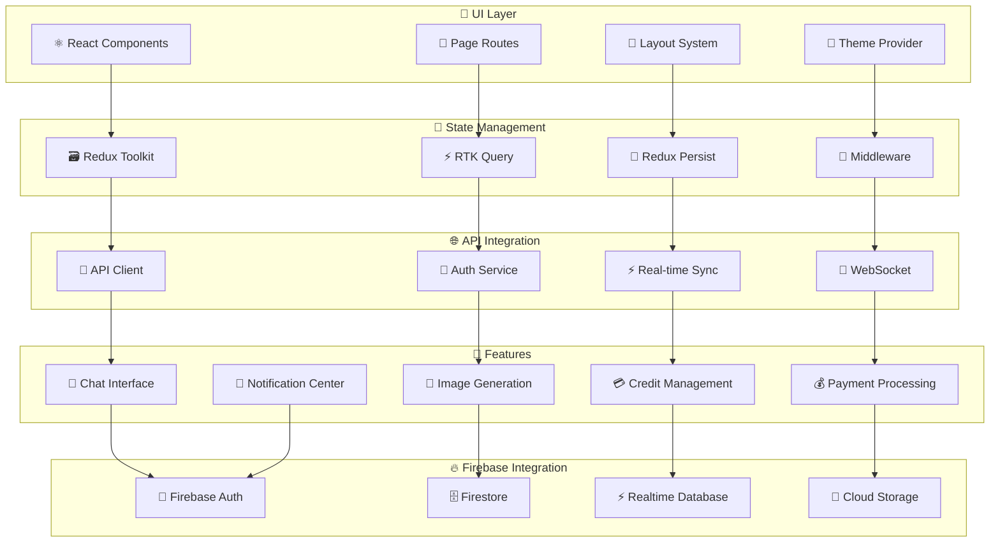

# 🎨 AI Assistant Platform - Frontend Client
### *Modern React Application with Real-Time AI Interactions*

> **A sophisticated, production-ready React frontend that provides an intuitive interface for AI conversations, image generation, credit management, and payment processing.** Built with TypeScript, Tailwind CSS, and modern React patterns for optimal user experience and developer productivity.

<div align="center">

**⚡ Real-Time Updates** • **🎨 Modern UI/UX** • **📱 Responsive Design** • **🔒 Secure Authentication**

*Seamlessly integrated with Firebase backend for instant synchronization*

</div>

---

## 🔥 Recent Updates & Fixes

### ✅ **Firebase Emulator Integration (Latest)**
- **Demo Project Configuration**: Updated to use `demo-project` for seamless emulator development
- **Authentication Fix**: Resolved client authentication issues with proper emulator connectivity
- **Environment Variables**: Pre-configured for Firebase emulators with `VITE_USE_EMULATORS=true`
- **Real-time Sync**: Enhanced Firebase integration for live balance updates and notifications
- **Hosting Integration**: Client served via Firebase hosting emulator at `http://127.0.0.1:5002`

### 🛠️ **Development Workflow**
```bash
# 1️⃣ Start Firebase emulators (from root directory)
firebase emulators:start --only auth,firestore,database,hosting --project demo-project

# 2️⃣ Access your application
Frontend App:       http://127.0.0.1:5002  (Firebase Hosting)
Development Server: http://localhost:3000   (Vite Dev Server)
Emulator UI:        http://127.0.0.1:4000   (Firebase Emulator Suite)
```

### 🚀 **Ready-to-Use Features**
- **🔐 Authentication**: Firebase Auth with emulator support
- **💬 Real-time Chat**: Live AI conversations with typing indicators
- **🎨 Image Generation**: Advanced AI image creation with progress tracking
- **💳 Credit Management**: Real-time balance updates and transaction history
- **💰 Payment Processing**: Multi-gateway payment support (Stripe, PayPal, Web3)
- **🔔 Notifications**: In-app alerts and system notifications
- **📱 PWA Support**: Offline functionality and native app experience

---

## 🌟 Frontend Capabilities

### 💬 **AI Chat Interface**
**Intelligent Conversation Management** - Real-time chat interface with multiple AI models, conversation history, message threading, and typing indicators for natural AI interactions.

### 🎨 **Image Generation Studio**
**Creative AI Workspace** - Advanced image generation interface with model selection, parameter controls, progress tracking, gallery management, and batch processing capabilities.

### 💳 **Credit Management Dashboard**
**Financial Control Center** - Real-time balance tracking, transaction history, usage analytics, low balance alerts, and seamless credit purchasing workflow.

### 💰 **Payment Processing Interface**
**Secure Payment Gateway** - Multi-method payment support including credit cards, PayPal, and Web3 cryptocurrencies with real-time transaction status and receipt management.

### 🔔 **Notification Center**
**Smart Alert System** - In-app notifications, preference management, quiet hours configuration, and multi-channel notification delivery status.

### 📊 **Analytics Dashboard**
**Usage Intelligence** - Comprehensive usage analytics, spending insights, model performance metrics, and personalized recommendations.

---

## 🏗️ Frontend Architecture



---

## 🚀 Quick Start Guide

### 📋 Prerequisites
```bash
✅ Node.js 18+
✅ npm or yarn
✅ Git
✅ Backend API running (see functions/README.md)
```

### ⚡ Installation & Setup
```bash
# 1️⃣ Navigate to client directory
cd client

# 2️⃣ Install dependencies
npm install

# 3️⃣ Environment setup (configured for demo-project)
cp .env.example .env.local
# .env is already configured for Firebase emulators

# 4️⃣ Start Firebase emulators (in root directory)
cd .. && firebase emulators:start --only auth,firestore,database,hosting --project demo-project

# 5️⃣ Start development (in client directory)
cd client
npm run dev          # 🚀 Start dev server (http://localhost:3000)
npm run build        # 🏗️ Build for production
npm run preview      # 👀 Preview production build
npm test             # 🧪 Run tests
npm run lint         # 🔍 Lint code
```

### 🔑 Environment Configuration
```bash
# 🔥 Firebase Configuration (Demo Project - Pre-configured)
VITE_FIREBASE_API_KEY=demo-key
VITE_FIREBASE_AUTH_DOMAIN=demo-project.firebaseapp.com
VITE_FIREBASE_PROJECT_ID=demo-project
VITE_FIREBASE_STORAGE_BUCKET=demo-project.appspot.com
VITE_FIREBASE_MESSAGING_SENDER_ID=123456789
VITE_FIREBASE_APP_ID=1:123456789:web:demo-app-id
VITE_FIREBASE_DATABASE_URL=https://demo-project-default-rtdb.firebaseio.com
VITE_USE_EMULATORS=true

# 🌐 API Configuration (Emulator Endpoints)
VITE_API_BASE_URL=http://127.0.0.1:5001/demo-project/us-central1/api
VITE_API_VERSION=v1

# 💳 Payment Configuration
VITE_STRIPE_PUBLISHABLE_KEY=pk_test_...
VITE_PAYPAL_CLIENT_ID=your_paypal_client_id

# 🎨 App Configuration
VITE_APP_NAME=AI Assistant Platform
VITE_APP_VERSION=1.0.0
VITE_ENABLE_ANALYTICS=true
```

---

## 📁 Project Structure

```
client/
├── 📂 public/                        # Static Assets
│   ├── 🖼️ images/                    # App images & icons
│   ├── 🎵 sounds/                    # Notification sounds
│   └── 📄 manifest.json              # PWA manifest
│
├── 📂 src/                           # Source Code
│   ├── 🎨 components/                # Reusable Components
│   │   ├── 💬 Chat/                  # Chat interface components
│   │   │   ├── ChatInterface.tsx     # Main chat component
│   │   │   ├── MessageList.tsx       # Message display
│   │   │   ├── MessageInput.tsx      # Message input
│   │   │   ├── ConversationList.tsx  # Conversation sidebar
│   │   │   └── ModelSelector.tsx     # AI model selection
│   │   │
│   │   ├── 🎨 ImageGeneration/       # Image generation components
│   │   │   ├── ImageGenerationForm.tsx # Generation form
│   │   │   ├── GenerationProgress.tsx  # Progress tracking
│   │   │   ├── ImageGallery.tsx        # Image gallery
│   │   │   ├── ModelSelector.tsx       # Model selection
│   │   │   └── ParameterControls.tsx   # Generation parameters
│   │   │
│   │   ├── 💳 CreditManagement/      # Credit system components
│   │   │   ├── BalanceDisplay.tsx     # Current balance
│   │   │   ├── TransactionHistory.tsx # Transaction list
│   │   │   ├── UsageAnalytics.tsx     # Usage charts
│   │   │   ├── LowBalanceAlert.tsx    # Balance alerts
│   │   │   └── CreditPurchase.tsx     # Purchase interface
│   │   │
│   │   ├── 💰 Payment/               # Payment components
│   │   │   ├── PaymentForm.tsx        # Payment form
│   │   │   ├── PaymentMethods.tsx     # Method selection
│   │   │   ├── CreditPackages.tsx     # Package options
│   │   │   ├── PaymentStatus.tsx      # Transaction status
│   │   │   ├── Web3Wallet.tsx         # Crypto wallet
│   │   │   └── BlockchainVerification.tsx # Blockchain verification
│   │   │
│   │   ├── 🔔 Notifications/         # Notification components
│   │   │   ├── NotificationCenter.tsx # Notification hub
│   │   │   ├── NotificationItem.tsx   # Individual notification
│   │   │   ├── NotificationPreferences.tsx # User preferences
│   │   │   ├── AlertBanner.tsx        # System alerts
│   │   │   └── ToastNotification.tsx  # Toast messages
│   │   │
│   │   ├── 🔐 Auth/                  # Authentication components
│   │   │   ├── LoginForm.tsx          # Login interface
│   │   │   ├── SignupForm.tsx         # Registration
│   │   │   ├── PasswordReset.tsx      # Password reset
│   │   │   ├── ProfileSettings.tsx    # User profile
│   │   │   └── AuthGuard.tsx          # Route protection
│   │   │
│   │   ├── 📊 Dashboard/             # Dashboard components
│   │   │   ├── DashboardLayout.tsx    # Main layout
│   │   │   ├── StatsCards.tsx         # Metric cards
│   │   │   ├── UsageCharts.tsx        # Usage visualization
│   │   │   ├── RecentActivity.tsx     # Activity feed
│   │   │   └── QuickActions.tsx       # Action buttons
│   │   │
│   │   └── 🔧 Common/                # Shared components
│   │       ├── Button.tsx             # Button component
│   │       ├── Input.tsx              # Input component
│   │       ├── Modal.tsx              # Modal component
│   │       ├── Loading.tsx            # Loading states
│   │       ├── ErrorBoundary.tsx      # Error handling
│   │       └── Layout.tsx             # App layout
│   │
│   ├── 📄 pages/                     # Page Components
│   │   ├── 🏠 Dashboard.tsx          # Main dashboard
│   │   ├── 💬 Chat.tsx               # Chat page
│   │   ├── 🎨 ImageGeneration.tsx    # Image generation
│   │   ├── 💳 Credits.tsx            # Credit management
│   │   ├── 💰 Payments.tsx           # Payment processing
│   │   ├── 🔔 Notifications.tsx      # Notifications
│   │   ├── ⚙️ Settings.tsx           # User settings
│   │   └── 🔐 Auth.tsx               # Authentication
│   │
│   ├── 🗃️ store/                     # Redux Store
│   │   ├── 🔧 index.ts               # Store configuration
│   │   ├── 💬 chatSlice.ts           # Chat state
│   │   ├── 🎨 imageSlice.ts          # Image generation state
│   │   ├── 💳 creditSlice.ts         # Credit state
│   │   ├── 💰 paymentSlice.ts        # Payment state
│   │   ├── 🔔 notificationSlice.ts   # Notification state
│   │   ├── 🔐 authSlice.ts           # Authentication state
│   │   └── 🌐 apiSlice.ts            # API state
│   │
│   ├── 🌐 services/                  # API Services
│   │   ├── 🔗 api.ts                 # Base API client
│   │   ├── 🔐 auth.ts                # Authentication service
│   │   ├── 💬 chat.ts                # Chat API
│   │   ├── 🎨 images.ts              # Image generation API
│   │   ├── 💳 credits.ts             # Credit management API
│   │   ├── 💰 payments.ts            # Payment processing API
│   │   ├── 🔔 notifications.ts       # Notification API
│   │   ├── 🔥 firebase.ts            # Firebase configuration
│   │   └── ⚡ realtime.ts            # Real-time sync
│   │
│   ├── 🎣 hooks/                     # Custom Hooks
│   │   ├── 🔐 useAuth.ts             # Authentication hook
│   │   ├── 💬 useChat.ts             # Chat functionality
│   │   ├── 🎨 useImageGeneration.ts  # Image generation
│   │   ├── 💳 useCredits.ts          # Credit management
│   │   ├── 💰 usePayments.ts         # Payment processing
│   │   ├── 🔔 useNotifications.ts    # Notifications
│   │   ├── ⚡ useRealtime.ts         # Real-time updates
│   │   └── 🌐 useApi.ts              # API interactions
│   │
│   ├── 🛠️ utils/                     # Utility Functions
│   │   ├── 🔧 helpers.ts             # General helpers
│   │   ├── 📅 dateUtils.ts           # Date formatting
│   │   ├── 💰 formatters.ts          # Number/currency formatting
│   │   ├── 🔐 validation.ts          # Form validation
│   │   ├── 🎨 constants.ts           # App constants
│   │   └── 🌐 api-utils.ts           # API utilities
│   │
│   ├── 🎯 types/                     # TypeScript Types
│   │   ├── 🔐 auth.ts                # Authentication types
│   │   ├── 💬 chat.ts                # Chat types
│   │   ├── 🎨 images.ts              # Image types
│   │   ├── 💳 credits.ts             # Credit types
│   │   ├── 💰 payments.ts            # Payment types
│   │   ├── 🔔 notifications.ts       # Notification types
│   │   └── 🌐 api.ts                 # API types
│   │
│   ├── 🎨 styles/                    # Styling
│   │   ├── 🌍 globals.css            # Global styles
│   │   ├── 🎯 components.css         # Component styles
│   │   └── 🎨 tailwind.css           # Tailwind imports
│   │
│   ├── 🧪 __tests__/                 # Test Files
│   │   ├── 🎨 components/            # Component tests
│   │   ├── 🎣 hooks/                 # Hook tests
│   │   ├── 🌐 services/              # Service tests
│   │   └── 🛠️ utils/                 # Utility tests
│   │
│   ├── 🚀 App.tsx                    # Main App component
│   ├── 🎯 main.tsx                   # App entry point
│   └── 🌍 vite-env.d.ts              # Vite type definitions
│
├── 📦 package.json                   # Dependencies & scripts
├── 🔧 vite.config.ts                 # Vite configuration
├── 🎨 tailwind.config.js             # Tailwind CSS config
├── 📝 tsconfig.json                  # TypeScript config
├── 🧪 vitest.config.ts               # Test configuration
└── 📚 README.md                      # This file
```

---

## 🎨 UI/UX Design System

### 🎯 **Design Principles**
- **🎨 Modern & Clean**: Minimalist design with focus on functionality
- **📱 Mobile-First**: Responsive design that works on all devices
- **⚡ Performance**: Optimized for fast loading and smooth interactions
- **♿ Accessible**: WCAG 2.1 AA compliant for inclusive design
- **🎭 Consistent**: Unified design language across all components

### 🌈 **Color Palette**
```css
/* Primary Colors */
--primary-50: #eff6ff;
--primary-500: #3b82f6;
--primary-600: #2563eb;
--primary-700: #1d4ed8;

/* Semantic Colors */
--success: #10b981;
--warning: #f59e0b;
--error: #ef4444;
--info: #06b6d4;

/* Neutral Colors */
--gray-50: #f9fafb;
--gray-100: #f3f4f6;
--gray-500: #6b7280;
--gray-900: #111827;
```

### 🎨 **Component Library**
- **🔘 Buttons**: Primary, secondary, ghost, icon variants
- **📝 Forms**: Input fields, selects, checkboxes, radio buttons
- **📊 Data Display**: Tables, cards, badges, progress bars
- **🔔 Feedback**: Alerts, toasts, modals, tooltips
- **🧭 Navigation**: Navbar, sidebar, breadcrumbs, tabs
- **📱 Layout**: Grid system, containers, spacing utilities

---

## 🔄 State Management

### 🗃️ **Redux Toolkit Setup**
```typescript
// Store configuration with RTK Query
export const store = configureStore({
  reducer: {
    auth: authSlice.reducer,
    chat: chatSlice.reducer,
    images: imageSlice.reducer,
    credits: creditSlice.reducer,
    payments: paymentSlice.reducer,
    notifications: notificationSlice.reducer,
    api: apiSlice.reducer,
  },
  middleware: (getDefaultMiddleware) =>
    getDefaultMiddleware({
      serializableCheck: {
        ignoredActions: [FLUSH, REHYDRATE, PAUSE, PERSIST, PURGE, REGISTER],
      },
    })
    .concat(apiSlice.middleware)
    .concat(persistMiddleware),
});
```

### ⚡ **Real-Time State Sync**
```typescript
// Real-time balance updates
const useRealtimeBalance = (userId: string) => {
  const dispatch = useAppDispatch();
  
  useEffect(() => {
    const unsubscribe = onBalanceUpdate(userId, (balance) => {
      dispatch(updateBalance(balance));
    });
    
    return unsubscribe;
  }, [userId, dispatch]);
};
```

---

## 🌐 API Integration

### 🔗 **RTK Query API Slices**
```typescript
// Chat API slice
export const chatApi = apiSlice.injectEndpoints({
  endpoints: (builder) => ({
    getConversations: builder.query<Conversation[], void>({
      query: () => '/chat/conversations',
      providesTags: ['Conversation'],
    }),
    sendMessage: builder.mutation<Message, SendMessageRequest>({
      query: ({ conversationId, message }) => ({
        url: `/chat/conversations/${conversationId}/messages`,
        method: 'POST',
        body: { message },
      }),
      invalidatesTags: ['Conversation'],
    }),
  }),
});
```

### ⚡ **Real-Time Updates**
```typescript
// WebSocket integration for real-time updates
const useRealtimeUpdates = () => {
  const dispatch = useAppDispatch();
  
  useEffect(() => {
    const socket = io(WEBSOCKET_URL);
    
    socket.on('balance_updated', (data) => {
      dispatch(updateBalance(data));
    });
    
    socket.on('message_received', (data) => {
      dispatch(addMessage(data));
    });
    
    return () => socket.disconnect();
  }, [dispatch]);
};
```

---

## 🧪 Testing Strategy

### 📊 **Test Coverage**
```
🎯 Component Tests: 95%+
🎣 Hook Tests: 90%+
🌐 Service Tests: 85%+
🔄 Integration Tests: 80%+
```

### 🧪 **Testing Tools**
- **⚡ Vitest**: Fast unit testing framework
- **🧪 React Testing Library**: Component testing utilities
- **🎭 MSW**: API mocking for tests
- **🔍 Playwright**: End-to-end testing
- **📊 Coverage**: Istanbul code coverage

### 🚀 **Running Tests**
```bash
# 🧪 Run all tests
npm test

# 🎯 Run specific test suites
npm run test:unit                    # Unit tests only
npm run test:integration             # Integration tests
npm run test:e2e                     # End-to-end tests
npm run test:watch                   # Watch mode

# 📊 Generate coverage report
npm run test:coverage

# 🔍 Run tests with UI
npm run test:ui
```

### 🧪 **Test Examples**
```typescript
// Component test example
describe('ChatInterface', () => {
  it('should send message when form is submitted', async () => {
    const user = userEvent.setup();
    render(<ChatInterface />);
    
    const input = screen.getByPlaceholderText('Type your message...');
    const button = screen.getByRole('button', { name: /send/i });
    
    await user.type(input, 'Hello AI!');
    await user.click(button);
    
    expect(screen.getByText('Hello AI!')).toBeInTheDocument();
  });
});

// Hook test example
describe('useAuth', () => {
  it('should handle login successfully', async () => {
    const { result } = renderHook(() => useAuth());
    
    await act(async () => {
      await result.current.login('test@example.com', 'password');
    });
    
    expect(result.current.user).toBeDefined();
    expect(result.current.isAuthenticated).toBe(true);
  });
});
```

---

## 🔐 Security & Authentication

### 🔥 **Firebase Authentication**
```typescript
// Firebase configuration with emulator support
const firebaseConfig = {
  apiKey: "demo-key",
  authDomain: "demo-project.firebaseapp.com",
  projectId: "demo-project",
  // ... other config
};

// Initialize Firebase with emulator connection
const app = initializeApp(firebaseConfig);
export const auth = getAuth(app);

// Connect to emulators in development
if (import.meta.env.DEV || import.meta.env.VITE_USE_EMULATORS === 'true') {
  connectAuthEmulator(auth, 'http://127.0.0.1:9099', { disableWarnings: true });
}

// Authentication service
export const authService = {
  async signIn(email: string, password: string) {
    const result = await signInWithEmailAndPassword(auth, email, password);
    return result.user;
  },
  
  async signUp(email: string, password: string) {
    const result = await createUserWithEmailAndPassword(auth, email, password);
    return result.user;
  },
  
  async signOut() {
    await signOut(auth);
  },
  
  onAuthStateChanged(callback: (user: User | null) => void) {
    return onAuthStateChanged(auth, callback);
  },
};
```

### 🛡️ **Route Protection**
```typescript
// Protected route component
const ProtectedRoute: React.FC<{ children: React.ReactNode }> = ({ children }) => {
  const { isAuthenticated, loading } = useAuth();
  
  if (loading) return <LoadingSpinner />;
  
  if (!isAuthenticated) {
    return <Navigate to="/auth/login" replace />;
  }
  
  return <>{children}</>;
};
```

### 🔒 **Security Best Practices**
- **🔐 Token Management**: Secure storage and automatic refresh
- **🛡️ Input Validation**: Client-side validation with server verification
- **🚫 XSS Protection**: Content sanitization and CSP headers
- **🔒 HTTPS Only**: Secure communication in production
- **🎭 Role-Based Access**: Feature access based on user permissions

---

## 📱 Progressive Web App (PWA)

### 🚀 **PWA Features**
- **📱 App-like Experience**: Native app feel on mobile devices
- **⚡ Offline Support**: Basic functionality without internet
- **🔔 Push Notifications**: Real-time alerts and updates
- **📲 Install Prompt**: Add to home screen capability
- **🔄 Background Sync**: Sync data when connection restored

### 📄 **Manifest Configuration**
```json
{
  "name": "AI Assistant Platform",
  "short_name": "AI Assistant",
  "description": "Advanced AI platform with credit management",
  "start_url": "/",
  "display": "standalone",
  "background_color": "#ffffff",
  "theme_color": "#3b82f6",
  "icons": [
    {
      "src": "/icons/icon-192.png",
      "sizes": "192x192",
      "type": "image/png"
    },
    {
      "src": "/icons/icon-512.png",
      "sizes": "512x512",
      "type": "image/png"
    }
  ]
}
```

---

## 🚀 Performance Optimization

### ⚡ **Performance Features**
- **🔄 Code Splitting**: Lazy loading of route components
- **📦 Bundle Optimization**: Tree shaking and minification
- **🖼️ Image Optimization**: WebP format and lazy loading
- **💾 Caching**: Service worker and browser caching
- **⚡ Virtual Scrolling**: Efficient rendering of large lists

### 📊 **Performance Metrics**
```
🎯 First Contentful Paint: < 1.5s
⚡ Largest Contentful Paint: < 2.5s
🔄 Cumulative Layout Shift: < 0.1
⚡ First Input Delay: < 100ms
📊 Lighthouse Score: 95+
```

### 🔧 **Optimization Techniques**
```typescript
// Lazy loading components
const ChatPage = lazy(() => import('./pages/Chat'));
const ImageGenerationPage = lazy(() => import('./pages/ImageGeneration'));

// Memoized components
const MessageList = memo(({ messages }: { messages: Message[] }) => {
  return (
    <div>
      {messages.map((message) => (
        <MessageItem key={message.id} message={message} />
      ))}
    </div>
  );
});

// Optimized API calls
const { data, isLoading } = useGetConversationsQuery(undefined, {
  pollingInterval: 30000, // Poll every 30 seconds
  skip: !isAuthenticated,
});
```

---

## 🌍 Internationalization (i18n)

### 🗣️ **Multi-Language Support**
- **🇺🇸 English**: Primary language
- **🇪🇸 Spanish**: Full translation
- **🇫🇷 French**: Full translation
- **🇩🇪 German**: Full translation
- **🇯🇵 Japanese**: Full translation

### 🔧 **i18n Configuration**
```typescript
// i18n setup
import i18n from 'i18next';
import { initReactI18next } from 'react-i18next';

i18n
  .use(initReactI18next)
  .init({
    resources: {
      en: { translation: enTranslations },
      es: { translation: esTranslations },
      fr: { translation: frTranslations },
    },
    lng: 'en',
    fallbackLng: 'en',
    interpolation: {
      escapeValue: false,
    },
  });
```

---

## 🚀 Deployment & Production

### 🏗️ **Build & Deploy**
```bash
# 🔨 Build for production
npm run build

# 👀 Preview production build
npm run preview

# 🚀 Deploy to hosting platform
npm run deploy

# 📊 Analyze bundle size
npm run analyze
```

### 🌍 **Hosting Options**
- **🔥 Firebase Hosting**: Integrated with backend
- **⚡ Vercel**: Optimized for React apps
- **🌐 Netlify**: JAMstack deployment
- **☁️ AWS S3 + CloudFront**: Enterprise hosting

### 📊 **Production Monitoring**
- **📈 Analytics**: User behavior tracking
- **🚨 Error Monitoring**: Real-time error reporting
- **⚡ Performance**: Core Web Vitals tracking
- **🔍 User Feedback**: In-app feedback collection

---

## 🤝 Contributing

### 📋 **Development Guidelines**
1. **⚛️ React Best Practices**: Follow React patterns and hooks guidelines
2. **📝 TypeScript**: Strict type safety required
3. **🎨 Design System**: Use consistent components and styling
4. **🧪 Testing**: Maintain high test coverage
5. **♿ Accessibility**: Ensure WCAG compliance

### 🔄 **Development Workflow**
```bash
# 1️⃣ Create feature branch
git checkout -b feature/your-feature

# 2️⃣ Make changes with tests
npm test

# 3️⃣ Build and validate
npm run build
npm run lint

# 4️⃣ Commit and push
git commit -m "feat: your feature description"
git push origin feature/your-feature

# 5️⃣ Create pull request
```

---

## 📄 License & Acknowledgments

### 📜 **License**
This project is proprietary and confidential. All rights reserved.

### 🙏 **Open Source Dependencies**
- **⚛️ React** - UI library
- **📝 TypeScript** - Type-safe JavaScript
- **🎨 Tailwind CSS** - Utility-first CSS framework
- **🗃️ Redux Toolkit** - State management
- **⚡ Vite** - Build tool and dev server
- **🧪 Vitest** - Testing framework
- **🔥 Firebase** - Backend integration

---

<div align="center">

### 🎨 **Built with Modern Frontend Technologies**

**React** • **TypeScript** • **Tailwind CSS** • **Redux Toolkit** • **Firebase**

*Crafted for exceptional user experience and developer productivity* ⚡

</div>